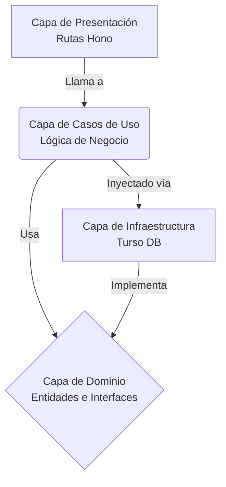

[🇺🇸 Read in English](./README.md)

# Black Mirror OS 📺

Black Mirror es una aplicación full-stack de estética futurista inspirada en una interfaz de televisión con tema oscuro. Ofrece una plataforma de streaming modular, un sistema de autenticación, grillas de contenido dinámicas y una arquitectura escalable diseñada para manejar miles de entradas de medios sin esfuerzo.

## ✨ Características Principales

- **UI/UX Futurista**: Una interfaz premium en modo oscuro construida con **Tailwind CSS v4**, con glassmorphism, animaciones dinámicas, acentos de neón y una barra de desplazamiento cinemática personalizada.
- **Arquitectura Universal de Contenido**: Una arquitectura JSON tipo NoSQL altamente escalable alojada en **Turso Edge Database**. Almacena Películas, Series, Anime y Anime para Adultos en una sola tabla unificada, utilizando JSON para flexibilidad infinita de esquema.
- **Scrapers Automatizados en Python**: Incluye un orquestador de scraping auto-actualizable (ej. Hentaila). Construido con `asyncio` y `httpx` de Python, extrae, procesa y sincroniza contenido periódicamente directo a la Base de Datos en la Nube de Turso.
- **API en el Edge**: Una API REST ultrarrápida construida con **Hono.js** y desplegada en **Cloudflare Workers**.
- **Filtrado de Contenido**: Módulo de configuración integrado para alternar categorías de contenido específicas (ej. Contenido para Adultos) de forma dinámica en el cliente.

---

## 🛠️ Stack Tecnológico

### Frontend (Cliente)
- **Framework**: React 19 (TypeScript) + Vite
- **Estilos**: Tailwind CSS v4
- **Iconos**: Lucide React
- **Arquitectura**: Domain-Driven Design (DDD) — `core/`, `infrastructure/`, `presentation/`

### Backend (API en el Edge)
- **Runtime**: Cloudflare Workers
- **Framework**: Hono.js
- **Base de Datos**: Turso (SQLite en el Edge) vía `@libsql/client`
- **Arquitectura**: Clean Architecture — `domain/`, `use_cases/`, `infrastructure/`, `presentation/`

### Motor de Scraping (Orquestador)
- **Lenguaje**: Python 3.9+
- **Framework**: FastAPI (para gestión del ciclo de vida)
- **Librerías**: `httpx` (HTTP asíncrono), `BeautifulSoup4` (parsing HTML)

---

## 📂 Estructura del Proyecto

```text
BlackMirror/
├── src/                        # Frontend React (Arquitectura DDD)
│   ├── core/                   # Reglas de Negocio
│   │   ├── domain/             # Modelos puros (tipos, interfaces)
│   │   └── useCases/           # Hooks personalizados con lógica de UI (ej. useContent)
│   ├── infrastructure/         # Implementaciones externas
│   │   └── services/           # Clientes de API (Cloudflare, endpoints de IA)
│   ├── presentation/           # Capa de UI
│   │   ├── components/         # Componentes reutilizables y "tontos"
│   │   └── views/              # Pantallas principales de la aplicación
│   ├── data/                   # Configuración estática (módulos por defecto)
│   ├── index.css               # Estilos globales de Tailwind y cinemáticos
│   └── App.tsx                 # Router principal y layout wrapper
├── server/                     # API en Cloudflare Worker (Hono)
│   └── src/                    # Clean Architecture
│       ├── domain/             # Entidades del dominio y errores personalizados
│       ├── use_cases/          # Lógica de negocio (Auth, Content)
│       ├── infrastructure/     # Cliente de Turso DB y repositorios
│       ├── presentation/       # Rutas/controladores HTTP de Hono
│       └── index.js            # Composition Root (Inyección de Dependencias)
└── Scraping/                   # Scrapers en Python
    └── Hentaila/               # Auto-Scraper de Anime para Adultos
        ├── api.py              # Ciclo de vida FastAPI y actualizador en segundo plano
        ├── database.py         # Conexión a Turso DB y consultas
        └── hentaila_scraper.py # Lógica de web scraping (BeautifulSoup4)
```

---

## 🏛️ Arquitectura

### Backend — Clean Architecture

El backend fue completamente refactorizado de un archivo monolítico a un patrón de **Clean Architecture** para garantizar la mantenibilidad y la separación de responsabilidades.



- **Capa de Dominio**: El corazón del software. Contiene entidades puras de `User` y `Content` sin ninguna dependencia.
- **Capa de Casos de Uso**: Contiene `AuthUseCases` y `ContentUseCases`. Orquesta el flujo de datos pero no sabe nada sobre la base de datos.
- **Capa de Infraestructura**: Contiene la implementación de Turso de nuestros repositorios. Si algún día migramos de Turso, solo esta carpeta cambia.
- **Capa de Presentación**: Maneja las solicitudes HTTP a través de Hono y delega el trabajo a los Casos de Uso.

### Frontend — Domain-Driven Design (DDD)

El frontend sigue un enfoque ligero de DDD optimizado para React:

- **Core / Domain**: Modelos e interfaces puras de TypeScript. Sin dependencia de framework.
- **Core / Use Cases**: Hooks personalizados (`useContent`) que encapsulan la lógica de negocio y el manejo de estado.
- **Infrastructure**: Servicios que saben cómo comunicarse con las APIs externas.
- **Presentation**: Componentes y Vistas que son puramente visuales. Reciben datos y los renderizan — nada más.

---

## 🚀 Configuración de Desarrollo Local

**Requisitos previos:** Node.js (v18+) y Python 3.9+

### 1. API en el Edge (Cloudflare Worker)
```bash
cd server
npm install
```
Creá un archivo `.dev.vars` dentro de `server/`:
```env
TURSO_DATABASE_URL=libsql://tu-url-db.turso.io
TURSO_AUTH_TOKEN=tu-token
```
```bash
npm run dev
# API corriendo en http://localhost:8787
```

### 2. Scrapers de Contenido (Python)
```bash
cd Scraping/Hentaila
pip install -r requirements.txt
```
Creá un archivo `.env` dentro de `Scraping/Hentaila/`:
```env
TURSO_DATABASE_URL=libsql://tu-url-db.turso.io
TURSO_AUTH_TOKEN=tu-token
```
```bash
python api.py
```

### 3. Frontend (Vite)
```bash
npm install
```
Opcionalmente creá un `.env` en la raíz del proyecto para apuntar a tu API de producción:
```env
VITE_API_URL=https://tu-url-cloudflare-worker.workers.dev
```
```bash
npm run dev
# UI en http://localhost:5173
```

---

## 📦 Esquema de Base de Datos

Este proyecto evita tablas fragmentadas usando una **Arquitectura Universal de Contenido**. Todo el contenido reside en una sola tabla `content`:

| Columna | Tipo | Descripción |
|---------|------|-------------|
| `slug` | `TEXT` | Clave primaria, identificador único del medio. |
| `content_type` | `TEXT` | Categoriza el medio (`movie`, `series`, `anime`, `adult_anime`). |
| `title` | `TEXT` | Título para mostrar. |
| `poster` | `TEXT` | URL de la imagen miniatura/póster. |
| `total_episodes` | `INTEGER` | Número de episodios (por defecto 1 para películas). |
| `details` | `TEXT (JSON)` | Esquema JSON flexible para datos específicos por tipo (servidores, actores, ratings). |

Esto permite búsquedas globales ultrarrápidas (`SELECT * FROM content WHERE title LIKE ?`) sin operaciones complejas de `JOIN` en SQL.

---

## 🔒 Seguridad y Buenas Prácticas

- **Variables de Entorno**: Todos los archivos `.env` y `.dev.vars` son ignorados globalmente por Git. Nunca subas credenciales.
- **Despliegue en el Edge**: El backend es completamente serverless, escalando automáticamente vía la red Edge de Cloudflare.
- **Errores de Dominio Tipados**: El backend usa clases de error tipadas (`NotFoundError`, `ValidationError`, `ConflictError`) en lugar de excepciones genéricas.
- **Manejo Elegante de Errores**: Los scrapers corren continuamente en segundo plano con bloques try-catch y concurrencia async para prevenir caídas.
