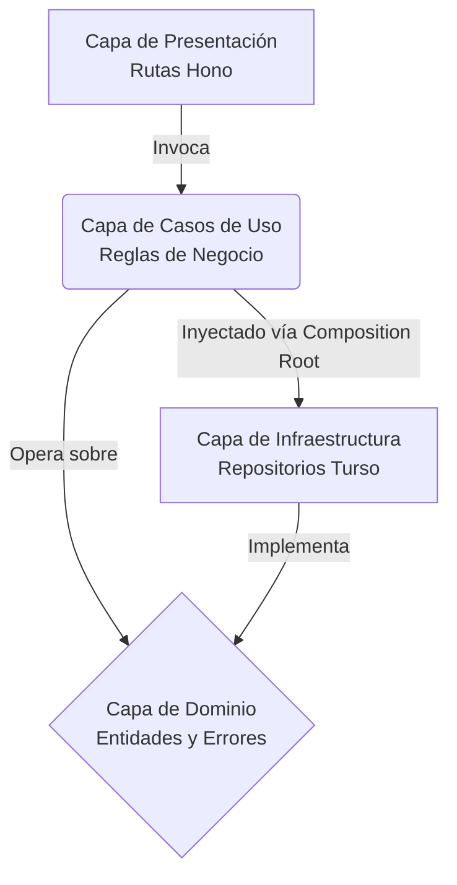
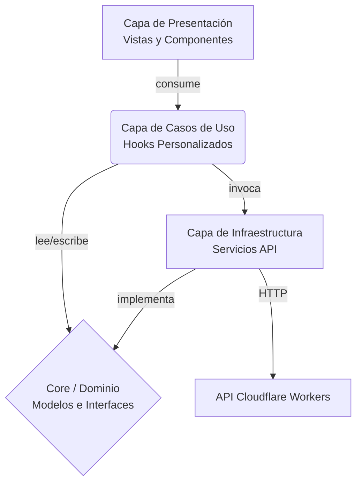

<div align="right">

[🇺🇸 Read in English](./README.md) | [🇪🇸 Leer en Español](./README.es.md)

</div>

<div align="center">
  
  <h1>Black Mirror OS</h1>
  <p><em>Plataforma de Streaming & IA de Nueva Generación Renderizada en el Edge</em></p>

  <!-- Badges -->
  
  
  
  
  
  
</div>

---

## 📖 Resumen

Black Mirror es una aplicación full-stack de nivel empresarial (enterprise-grade) con una estética futurista inspirada en una interfaz de sistema operativo en modo oscuro. Ofrece una plataforma de streaming modular, un robusto sistema de autenticación, grillas de contenido dinámicas y una arquitectura inmensamente escalable diseñada para manejar miles de entradas de medios sin esfuerzo en la red Edge.

El proyecto demuestra patrones arquitectónicos avanzados en todo el stack, incluyendo **Clean Architecture** en el backend y **Domain-Driven Design (DDD)** en el frontend, garantizando máxima mantenibilidad, capacidad de testeo y escalabilidad.

## ✨ Características Principales

- **UI/UX Futurista**: Una interfaz premium en modo oscuro construida con **Tailwind CSS v4**, con glassmorphism, animaciones dinámicas, detalles en neón y una barra de desplazamiento cinemática personalizada.
- **Arquitectura Universal de Contenido**: Una arquitectura híbrida JSON tipo NoSQL altamente escalable alojada en **Turso Edge Database**. Almacena Películas, Series, Anime y Anime para Adultos en una sola tabla unificada, utilizando payloads JSON para flexibilidad infinita de esquema.
- **Scrapers Automatizados en Python**: Incluye un orquestador de scraping auto-actualizable. Construido con `asyncio`, `FastAPI` y `httpx` de Python, extrae, procesa y sincroniza contenido fresco periódicamente directo a la Base de Datos en la Nube de Turso en segundo plano.
- **API en el Edge y Caché**: Una API REST ultrarrápida construida con **Hono.js** y desplegada en **Cloudflare Workers**. Utiliza una estrategia de Caché Short-TTL (`max-age=60`) para servir JSONs instantáneamente desde nodos Edge, reduciendo consultas a la DB un 99% en picos de tráfico manteniendo el contenido fresco.
- **SWR y Paginación en el Frontend**: La UI aprovecha **SWR (Stale-While-Revalidate)** y Scroll Infinito para cargar contenido de la memoria al instante al cambiar de rutas, mientras busca actualizaciones de fondo de forma silenciosa, evitando el congelamiento del DOM incluso con más de 10,000 elementos.
- **Prefetching Predictivo & Enrutamiento Dinámico**: Utiliza prefetching predictivo basado en intención al pasar el cursor (hover) para lograr transiciones de página con latencia cero, y un motor de enrutamiento dinámico personalizado para una navegación SPA fluida sin dependencias externas.
- **Arquitectura Empresarial**: Estricta separación de responsabilidades que garantiza que la interfaz de usuario no sepa nada sobre cómo se obtienen los datos de la API, y las rutas HTTP no sepan nada sobre las implementaciones de la base de datos.

---

## 🏛️ Arquitectura Empresarial

### Backend — Clean Architecture (Cloudflare Workers)

La API del backend evita la clásica trampa del "monolito" al implementar una **Clean Architecture** estricta. Esto garantiza la separación de responsabilidades y prepara el código para el futuro.



- **Capa de Dominio**: El núcleo de la aplicación. Contiene las entidades puras `User` y `Content` sin dependencias externas.
- **Capa de Casos de Uso**: Contiene reglas de negocio específicas de la aplicación (`AuthUseCases`, `ContentUseCases`). Orquesta el flujo de datos sin saber *de dónde* provienen los mismos.
- **Capa de Infraestructura**: Implementaciones concretas de nuestras interfaces. Actualmente impulsada por Turso (SQLite en el Edge). Cambiar de base de datos solo requiere intercambiar esta carpeta.
- **Capa de Presentación**: El punto de entrada. Maneja las solicitudes HTTP a través de Hono, autentica tokens y delega la ejecución a los Casos de Uso.
- **Composition Root**: La inyección de dependencias se maneja a nivel de cada solicitud en `index.js`, garantizando un uso seguro de la memoria en el entorno serverless de Cloudflare Workers.

### Frontend — Domain-Driven Design (DDD)

El frontend de React aplica un patrón **Domain-Driven Design** ligero y escalable, resolviendo el clásico problema de "estado espagueti" común en aplicaciones React:



- **Core / Domain**: Modelos e interfaces puras de TypeScript. Agnóstico del framework.
- **Core / Use Cases**: Hooks personalizados (ej. `useContent`, `useContentDetail`) que encapsulan la lógica de negocio, la gestión de estado y los efectos secundarios. Potenciados por SWR para caché y prefetching predictivo.
- **Infrastructure**: Servicios de API que manejan la comunicación HTTP con Cloudflare y endpoints de IA.
- **Presentation**: Componentes y Vistas puramente visuales. Reciben datos de los Casos de Uso y los renderizan — no hacen fetch de datos directamente.

---

## 📦 Esquema de Base de Datos

Este proyecto evita tablas fragmentadas y migraciones complejas utilizando una **Arquitectura Universal de Contenido**. Todo el contenido reside en una única tabla `content` altamente indexada:

| Columna | Tipo | Descripción |
|---------|------|-------------|
| `slug` | `TEXT` | Clave primaria, identificador único del medio. |
| `content_type` | `TEXT` | Categoriza el medio (`movie`, `series`, `anime`, `adult_anime`). |
| `title` | `TEXT` | Título para mostrar. |
| `poster` | `TEXT` | URL del póster/miniatura. |
| `total_episodes` | `INTEGER` | Cantidad de episodios (por defecto 1 para películas). |
| `details` | `TEXT (JSON)` | Esquema JSON flexible para datos específicos del tipo (ej. servidores, actores, clasificaciones). |

Este enfoque híbrido SQL/NoSQL permite búsquedas globales ultrarrápidas (`SELECT * FROM content WHERE title LIKE ?`) sin costosas operaciones `JOIN`, mientras retiene la flexibilidad del formato JSON para metadatos complejos y profundamente anidados.

---

## 📂 Estructura del Repositorio

```text
BlackMirror/
├── src/                        # Frontend React (Arquitectura DDD)
│   ├── core/                   
│   │   ├── domain/             # Modelos puros en TS (tipos, interfaces)
│   │   └── useCases/           # Hooks personalizados de React con la lógica
│   ├── infrastructure/         # Implementaciones externas (clientes API)
│   ├── presentation/           # Capa de UI (vistas y componentes "tontos")
│   └── App.tsx                 # Enrutador principal
├── server/                     # API en Cloudflare Worker (Hono)
│   └── src/                    # Clean Architecture del Backend
│       ├── domain/             # Entidades principales y errores
│       ├── use_cases/          # Lógica de negocio
│       ├── infrastructure/     # Cliente DB Turso y repositorios
│       ├── presentation/       # Rutas HTTP (Hono)
│       └── index.js            # Composition Root (Inyección de Dependencias)
└── Scraping/                   # Scrapers en Python
    ├── Hentaila/               # Scraper de Anime Adulto (hentaila.com)
    │   ├── api.py              # Orquestador FastAPI y tarea en segundo plano
    │   ├── database.py         # Conexión directa a la BD de Turso
    │   └── hentaila_scraper.py # Lógica de web scraping (BeautifulSoup4)
    └── Animeav1/               # Scraper de Anime regular (animeav1.com)
        ├── api.py              # Orquestador FastAPI y tarea en segundo plano
        ├── database.py         # Conexión directa a la BD de Turso
        └── animeav1_scraper.py # Scraper asíncrono (httpx + tenacity + SvelteKit)
```

---

## 🚀 Configuración de Desarrollo Local

**Requisitos previos:** Node.js (v18+) y Python 3.9+

### 1. API en el Edge (Cloudflare Worker)
```bash
cd server
npm install
```
Creá un archivo `.dev.vars` dentro de `server/`:
```env
TURSO_DATABASE_URL=libsql://tu-url-db.turso.io
TURSO_AUTH_TOKEN=tu-token
```
```bash
npm run dev
# La API correrá en http://localhost:8787
```

### 2. Scrapers de Contenido (Python)
Hay múltiples scrapers independientes disponibles en el directorio `Scraping/`. Por ejemplo, para correr el scraper de Anime Adulto (Hentaila) o el scraper de Anime regular (AnimeAV1):
```bash
cd Scraping/Hentaila # O cd Scraping/Animeav1
pip install -r requirements.txt
```
Creá un archivo `.env` dentro del directorio específico del scraper:
```env
TURSO_DATABASE_URL=libsql://tu-url-db.turso.io
TURSO_AUTH_TOKEN=tu-token
```
```bash
python api.py
# El daemon de scraping se ejecutará en segundo plano y expondrá una API de salud en el puerto 8000 (Hentaila) u 8001 (Animeav1)
```

### 3. Frontend (Vite)
Abrí una nueva terminal en la raíz del proyecto:
```bash
npm install
```
Opcionalmente, creá un archivo `.env` para apuntar a tu API en producción:
```env
VITE_API_URL=https://tu-url-worker.workers.dev
```
```bash
npm run dev
# La UI correrá en http://localhost:5173
```

---

## 🔒 Seguridad y Mejores Prácticas

- **Entorno Zero-Trust**: Todos los archivos `.env` y `.dev.vars` son ignorados globalmente por Git. 
- **Despliegue en el Edge**: El backend es 100% serverless, escalando automáticamente a través de la red global Edge de Cloudflare.
- **Errores de Dominio Personalizados**: El backend evita las excepciones genéricas utilizando estrictas clases de error tipadas (`NotFoundError`, `ValidationError`, `ConflictError`).
- **Scraping Resiliente**: El scraper en Python corre en un bucle continuo en segundo plano, con bloques `try-catch` localizados y concurrencia mediante `asyncio`, previniendo fugas de memoria y bloqueos de la aplicación.
