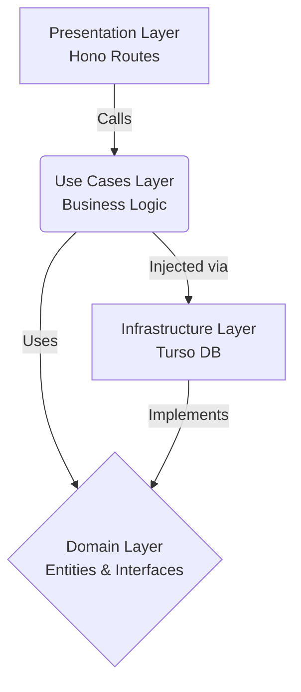

[🇪🇸 Leer en Español](./README.es.md)

# Black Mirror OS 📺

Black Mirror is a futuristic, TV-inspired full-stack application featuring a sleek, dark-themed OS interface. It provides a modular streaming platform, an authentication system, dynamic content grids, and a scalable architecture designed to handle thousands of media entries effortlessly.

## ✨ Core Features

- **Futuristic UI/UX**: A premium dark-mode interface built with **Tailwind CSS v4**, featuring glassmorphism, dynamic animations, flowing neon accents, and a custom cinematic scrollbar.
- **Universal Content Architecture**: A highly scalable NoSQL-like JSON architecture hosted on a **Turso Edge Database**. It stores Movies, Series, Anime, and Adult Anime in a single unified table, using JSON payloads for infinite schema flexibility.
- **Automated Python Scrapers**: Includes a self-hosted, auto-updating scraper orchestrator (e.g., Hentaila). Built with Python `asyncio` and `httpx`, it periodically scrapes, processes, and syncs fresh content directly to the Turso Cloud Database.
- **Edge API**: A blazing fast REST API built with **Hono.js** and deployed on **Cloudflare Workers**.
- **Content Filtering**: Built-in settings module to seamlessly toggle specific content categories (e.g., Adult Content) dynamically on the client side.

---

## 🛠️ Tech Stack

### Frontend (Client)
- **Framework**: React 19 (TypeScript) + Vite
- **Styling**: Tailwind CSS v4
- **Icons**: Lucide React
- **Architecture**: Domain-Driven Design (DDD) — `core/`, `infrastructure/`, `presentation/`

### Backend (Edge API)
- **Runtime**: Cloudflare Workers
- **Framework**: Hono.js
- **Database**: Turso (SQLite on the Edge) via `@libsql/client`
- **Architecture**: Clean Architecture — `domain/`, `use_cases/`, `infrastructure/`, `presentation/`

### Scraping Engine (Orchestrator)
- **Language**: Python 3.9+
- **Framework**: FastAPI (for lifecycle management)
- **Libraries**: `httpx` (async HTTP), `BeautifulSoup4` (HTML parsing)

---

## 📂 Project Structure

```text
BlackMirror/
├── src/                        # React Frontend (DDD Architecture)
│   ├── core/                   # Business Rules
│   │   ├── domain/             # Pure models (types, interfaces)
│   │   └── useCases/           # Custom hooks with UI logic (e.g., useContent)
│   ├── infrastructure/         # External implementations
│   │   └── services/           # API clients (Cloudflare, AI endpoints)
│   ├── presentation/           # UI Layer
│   │   ├── components/         # Reusable, "dumb" UI components
│   │   └── views/              # Main application screens
│   ├── data/                   # Static configuration (default modules)
│   ├── index.css               # Global Tailwind and cinematic styles
│   └── App.tsx                 # Main router and layout wrapper
├── server/                     # Cloudflare Worker API (Hono)
│   └── src/                    # Clean Architecture
│       ├── domain/             # Core entities and custom errors
│       ├── use_cases/          # Business logic (Auth, Content)
│       ├── infrastructure/     # Turso DB client and repositories
│       ├── presentation/       # Hono HTTP routes/controllers
│       └── index.js            # Composition Root (Dependency Injection)
└── Scraping/                   # Python Scrapers
    └── Hentaila/               # Adult Anime Auto-Scraper
        ├── api.py              # FastAPI lifecycle and background updater
        ├── database.py         # Turso DB connection and queries
        └── hentaila_scraper.py # Web scraping logic (BeautifulSoup4)
```

---

## 🏛️ Architecture

### Backend — Clean Architecture

The backend has been completely refactored from a monolithic file into a **Clean Architecture** pattern to guarantee maintainability and separation of concerns.



- **Domain Layer**: The heart of the software. Contains pure `User` and `Content` entities with zero dependencies.
- **Use Cases Layer**: Contains `AuthUseCases` and `ContentUseCases`. Orchestrates the flow of data but knows nothing about the database.
- **Infrastructure Layer**: Contains the Turso implementation of our repositories. If we ever migrate away from Turso, only this folder changes.
- **Presentation Layer**: Handles HTTP requests via Hono and delegates work to the Use Cases.

### Frontend — Domain-Driven Design (DDD)

The frontend follows a lightweight DDD approach optimized for React:

- **Core / Domain**: Pure TypeScript models and interfaces. No framework dependency.
- **Core / Use Cases**: Custom hooks (`useContent`) that encapsulate business logic and state management.
- **Infrastructure**: Services that know how to communicate with external APIs.
- **Presentation**: Components and Views that are purely visual. They receive data and render it — nothing more.

---

## 🚀 Local Development Setup

**Prerequisites:** Node.js (v18+) and Python 3.9+

### 1. Edge API (Cloudflare Worker)
```bash
cd server
npm install
```
Create a `.dev.vars` file inside `server/`:
```env
TURSO_DATABASE_URL=libsql://your-db-url.turso.io
TURSO_AUTH_TOKEN=your-token
```
```bash
npm run dev
# API running at http://localhost:8787
```

### 2. Content Scrapers (Python)
```bash
cd Scraping/Hentaila
pip install -r requirements.txt
```
Create a `.env` file inside `Scraping/Hentaila/`:
```env
TURSO_DATABASE_URL=libsql://your-db-url.turso.io
TURSO_AUTH_TOKEN=your-token
```
```bash
python api.py
```

### 3. Frontend (Vite)
```bash
npm install
```
Optionally create a `.env` in the project root to point to your production API:
```env
VITE_API_URL=https://your-cloudflare-worker-url.workers.dev
```
```bash
npm run dev
# UI at http://localhost:5173
```

---

## 📦 Database Schema

This project avoids fragmented tables by using a **Universal Content Architecture**. All content resides in a single `content` table:

| Column | Type | Description |
|--------|------|-------------|
| `slug` | `TEXT` | Primary key, unique identifier for the media. |
| `content_type` | `TEXT` | Categorizes the media (`movie`, `series`, `anime`, `adult_anime`). |
| `title` | `TEXT` | Display title. |
| `poster` | `TEXT` | URL to the thumbnail/poster image. |
| `total_episodes` | `INTEGER` | Number of episodes (defaults to 1 for movies). |
| `details` | `TEXT (JSON)` | Flexible JSON schema for type-specific data (servers, actors, ratings). |

This enables blazing-fast global searches (`SELECT * FROM content WHERE title LIKE ?`) without complex SQL `JOIN` operations.

---

## 🔒 Security & Best Practices

- **Environment Variables**: All `.env` and `.dev.vars` files are globally ignored by Git. Never commit credentials.
- **Edge Deployment**: The backend is completely serverless, scaling automatically via Cloudflare's Edge network.
- **Custom Domain Errors**: The backend uses typed error classes (`NotFoundError`, `ValidationError`, `ConflictError`) instead of generic exceptions.
- **Graceful Error Handling**: Scrapers run continuously in the background with try-catch blocks and async concurrency to prevent crashes.
