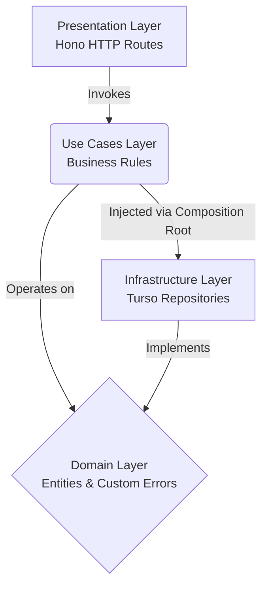

[🇺🇸 Read in English](./README.md) | [🇪🇸 Leer en Español](./README.es.md)

<div align="center">
  
  <h1>Black Mirror OS</h1>
  <p><em>A Next-Generation, Edge-Rendered Streaming & AI Platform</em></p>

  <!-- Badges -->
  
  
  
  
  
  
</div>

---

## 📖 Overview

Black Mirror is an enterprise-grade, full-stack application featuring a sleek, dark-themed OS interface. It provides a modular streaming platform, a robust authentication system, dynamic content grids, and an immensely scalable architecture designed to handle thousands of media entries effortlessly on the Edge.

The project demonstrates advanced architectural patterns across the stack, including **Clean Architecture** on the backend and **Domain-Driven Design (DDD)** on the frontend, ensuring maximum maintainability, testability, and scalability.

## ✨ Core Features

- **Futuristic UI/UX**: A premium dark-mode interface built with **Tailwind CSS v4**, featuring glassmorphism, dynamic animations, flowing neon accents, and a custom cinematic scrollbar.
- **Universal Content Architecture**: A highly scalable NoSQL-like JSON architecture hosted on a **Turso Edge Database**. It stores Movies, Series, Anime, and Adult Anime in a single unified table, using JSON payloads for infinite schema flexibility.
- **Automated Python Scrapers**: Includes a self-hosted, auto-updating scraper orchestrator. Built with Python `asyncio`, `FastAPI`, and `httpx`, it periodically scrapes, processes, and syncs fresh content directly to the Turso Cloud Database in the background.
- **Edge API & Caching**: A blazing fast REST API built with **Hono.js** and deployed on **Cloudflare Workers** for zero cold starts. It utilizes a Short-TTL Cache strategy (`Cache-Control: max-age=60`) to instantly serve JSON payloads from Edge nodes, reducing database queries by 99% during traffic spikes while keeping content fresh.
- **Frontend SWR & Pagination**: The UI leverages **SWR (Stale-While-Revalidate)** and Infinite Scrolling to instantly load content from memory on route changes while silently re-fetching updates, ensuring smooth navigation without DOM freezing even with 10,000+ items.
- **Enterprise Architecture**: Strict separation of concerns ensuring the UI knows nothing about API fetching, and the HTTP routes know nothing about database implementations.

---

## 🏛️ Enterprise Architecture

### Backend — Clean Architecture (Cloudflare Workers)

The backend API avoids the common "monolith" trap by implementing strict **Clean Architecture**. This guarantees separation of concerns and future-proofs the codebase.



- **Domain Layer**: The core of the application. Contains pure `User` and `Content` entities with zero external dependencies.
- **Use Cases Layer**: Contains application-specific business rules (`AuthUseCases`, `ContentUseCases`). It orchestrates data flow without knowing *where* the data comes from.
- **Infrastructure Layer**: Concrete implementations of our interfaces. Currently powered by Turso (SQLite on the Edge). Changing databases only requires swapping this folder.
- **Presentation Layer**: The entry point. Handles HTTP requests via Hono, authenticates tokens, and delegates execution to the Use Cases.
- **Composition Root**: Dependency injection is handled at the request level in `index.js`, ensuring safe memory usage in the serverless Cloudflare Workers environment.

### Frontend — Domain-Driven Design (DDD)

The React frontend applies a lightweight, scalable **Domain-Driven Design** pattern, resolving the classic "spaghetti state" problem common in React apps:

- **Core / Domain**: Pure TypeScript models and interfaces. Framework-agnostic.
- **Core / Use Cases**: Custom hooks (e.g., `useContent`) that encapsulate business logic, state management, and side effects.
- **Infrastructure**: API services that handle HTTP communication with Cloudflare and AI endpoints.
- **Presentation**: Purely visual Components and Views. They receive data from Use Cases and render it—they do not fetch data directly.

---

## 📦 Database Schema Design

This project avoids fragmented tables and complex migrations by using a **Universal Content Architecture**. All content resides in a single, highly indexed `content` table:

| Column | Type | Description |
|---------|------|-------------|
| `slug` | `TEXT` | Primary key, unique identifier for the media. |
| `content_type` | `TEXT` | Categorizes the media (`movie`, `series`, `anime`, `adult_anime`). |
| `title` | `TEXT` | Display title. |
| `poster` | `TEXT` | URL to the thumbnail/poster image. |
| `total_episodes` | `INTEGER` | Number of episodes (defaults to 1 for movies). |
| `details` | `TEXT (JSON)` | Flexible JSON schema for type-specific data (e.g., servers, actors, ratings). |

This hybrid SQL/NoSQL approach enables blazing-fast global searches (`SELECT * FROM content WHERE title LIKE ?`) without expensive `JOIN` operations, while retaining the flexibility of JSON for complex, deeply nested metadata.

---

## 📂 Repository Structure

```text
BlackMirror/
├── src/                        # React Frontend (DDD Architecture)
│   ├── core/                   
│   │   ├── domain/             # Pure TS models (types, interfaces)
│   │   └── useCases/           # Custom React hooks containing UI logic
│   ├── infrastructure/         # External implementations (API clients)
│   ├── presentation/           # UI Layer (dumb components and views)
│   └── App.tsx                 # Main router
├── server/                     # Cloudflare Worker API (Hono)
│   └── src/                    # Backend Clean Architecture
│       ├── domain/             # Core entities and errors
│       ├── use_cases/          # Business logic
│       ├── infrastructure/     # Turso DB client and repositories
│       ├── presentation/       # Hono HTTP routes
│       └── index.js            # Composition Root (Dependency Injection)
└── Scraping/                   # Python Scrapers
    └── Hentaila/               # Automated Scraper
        ├── api.py              # FastAPI orchestrator and background task
        ├── database.py         # Direct Turso DB connection
        └── hentaila_scraper.py # Web scraping logic (BeautifulSoup4)
```

---

## 🚀 Local Development Setup

**Prerequisites:** Node.js (v18+) and Python 3.9+

### 1. Edge API (Cloudflare Worker)
```bash
cd server
npm install
```
Create a `.dev.vars` file inside `server/`:
```env
TURSO_DATABASE_URL=libsql://your-db-url.turso.io
TURSO_AUTH_TOKEN=your-token
```
```bash
npm run dev
# API will run at http://localhost:8787
```

### 2. Content Scrapers (Python)
```bash
cd Scraping/Hentaila
pip install -r requirements.txt
```
Create a `.env` file inside `Scraping/Hentaila/`:
```env
TURSO_DATABASE_URL=libsql://your-db-url.turso.io
TURSO_AUTH_TOKEN=your-token
```
```bash
python api.py
```

### 3. Frontend (Vite)
Open a new terminal at the project root:
```bash
npm install
```
Optionally create a `.env` to point to your production API:
```env
VITE_API_URL=https://your-cloudflare-worker-url.workers.dev
```
```bash
npm run dev
# UI will run at http://localhost:5173
```

---

## 🔒 Security & Best Practices

- **Zero-Trust Environment Variables**: All `.env` and `.dev.vars` files are globally ignored by Git. 
- **Edge Deployment**: The backend is completely serverless, scaling automatically via Cloudflare's global Edge network.
- **Custom Domain Errors**: The backend avoids generic exceptions, utilizing strictly typed error classes (`NotFoundError`, `ValidationError`, `ConflictError`).
- **Resilient Scraping**: The Python scraper runs on a continuous background loop with localized try-catch blocks and `asyncio` concurrency, preventing memory leaks and application crashes.
